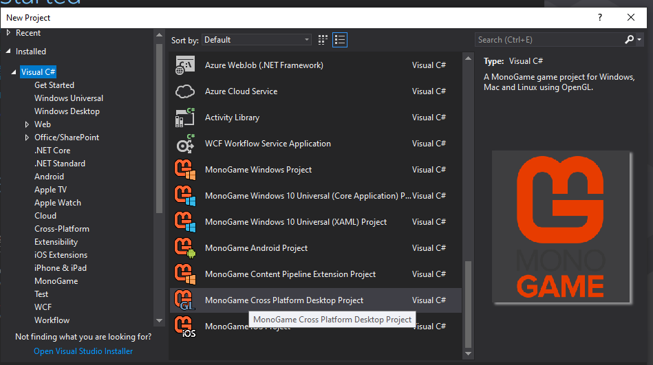
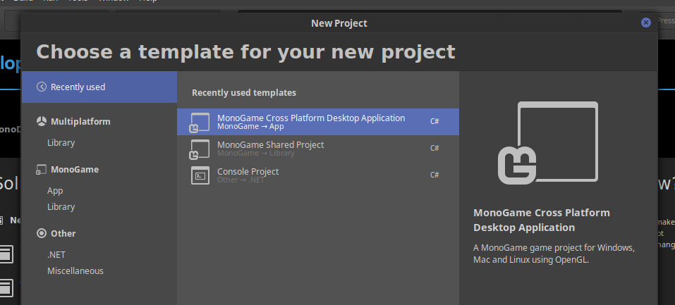
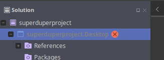
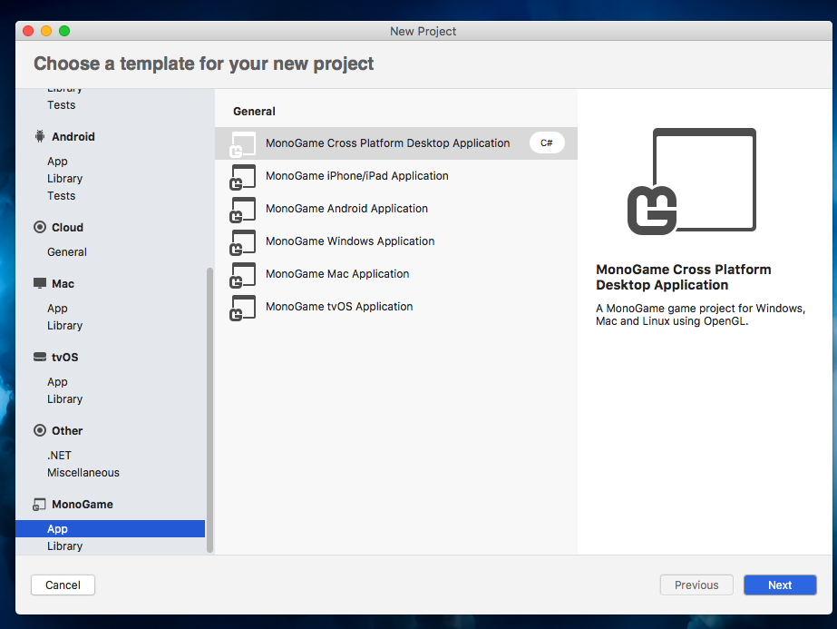
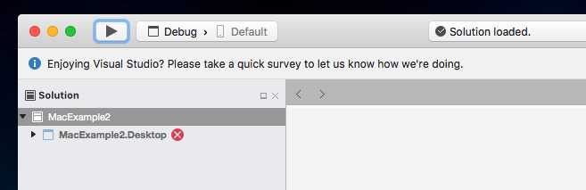

# Creating a cross platform desktop project

## Windows: 
1. Start by creating a new "Monogame Cross Platform Desktop Project" in Visual Studio

1. Next add the .gitignore file found in the OPENGL-PROJECT-TEMPLATE directory. And place it the same place as your .sln file.

1. Now you are ready to start programming with monogame.

## Linux:

1. Start by creating a "MonoGame Cross Platform Desktop Application" in monodevelop.

1. Because you created this project in Linux you need to do one more step.

1. You will notice that your project has this annoying red x:

1. 

1. You need to use your favorite text editor and open the \<projectname\>.Desktop.csproj file and replace the 3 occurences of "Any CPU" with "AnyCPU". 

1. Save and close the file.

1. Next add the .gitignore file found in the OPENGL-PROJECT-TEMPLATE directory And place it the same place as your .sln file.

1. Now you are ready to start programming with monogame.

## MAC:

1. Because you are using a Mac you need to do a few extra steps when you want to create a project.

1. If you don't have the option to create a new "MonoGame Cross Platform Desktop Application" then you need to do the following.
   1. Go to VisualStudio->extensions-> and select the "Installed" tab and you should see a Game Development option, and under that you should see
   two options. One for a "monogame addin" and one for a "monogame extension".
   1. You need to disable them both and then re-enable them one at a time **_first the extension, then the addin_**.
   1. Now you should be able to create a "MonoGame Cross Platform Desktop Application"

1. Start by creating a "MonoGame Cross Platform Desktop Application" in VisualStudio.

1. Because you created this project in a Mac you need to do one more step.

1. You will notice that your project has this annoying red x:

1. 

1. You need to use your favorite text editor and open the \<projectname\>.Desktop.csproj file and replace the 3 occurences of "Any CPU" with "AnyCPU". 

1. Save and close the file.

1. Next add the .gitignore file found in the OPENGL-PROJECT-TEMPLATE directory And place it the same place as your .sln file.

1. Now you are ready to start programming with monogame.

1. If the above instructions don't work for you you can always download the OPENGL-PROJECT-TEMPLATE located on the github page.
